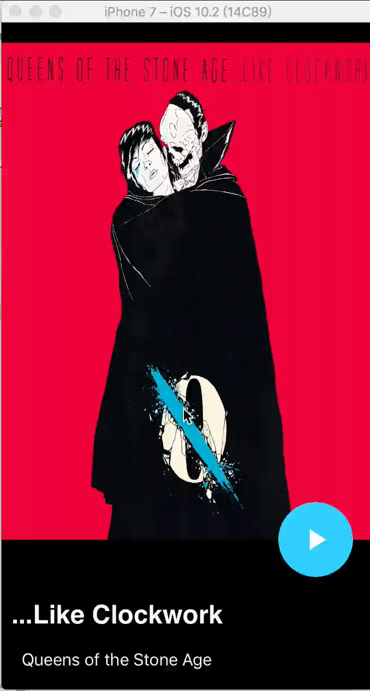

# RevealAnimation

一个酷炫的播放器效果。

最早是是在github上看到的，但是那个是安卓版的，所以就自己移植到ios版上。

至于原文链接，原谅我忘记了。实在抱歉对不起作者

效果演示如下：

**如果这个gif演示太卡，可以单击gif在新页面打开**

其实如果细心拆分，按部就班实现，其实不难。

圆圈的轨迹可能比较难实现，用到贝塞尔曲线等作为其动画路径

*欢迎star交流*